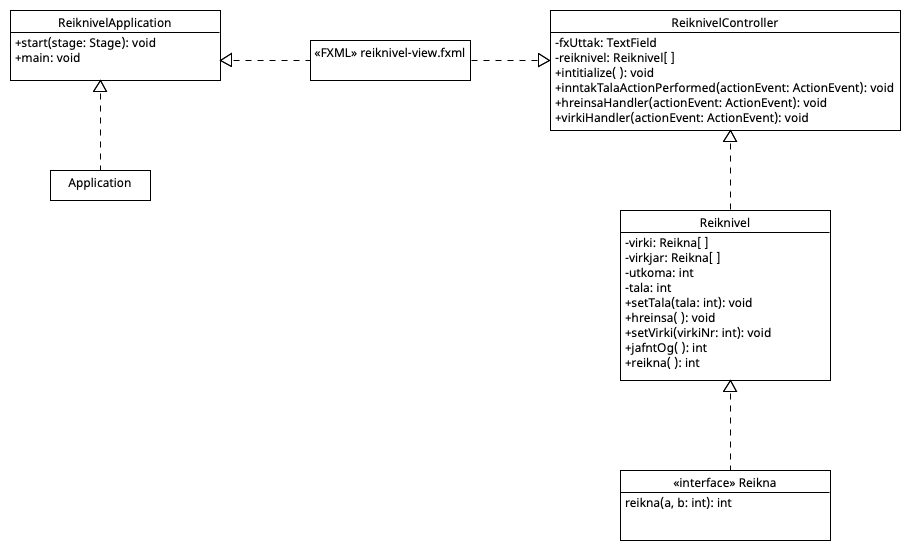

# Reiknivél(e. Calculator)

This is a Maven project that provides a simple calculator. 
The calculator is able to perform addidtion, subtraction,
multiplication and division of integers. 

# Project Structure

The project follows the standard Maven project structure, which is as follows:

- `src/main/java`: Contains the folders vinnsla and vidmot. 
    - `is/vidmot/ReiknivelController.java`: Controller class for the calculator. Contains the handlers for the integers and the operators. Connects to classes in the vinnsla folder. 
    - `is/vidmot/ReiknivelApplication.java`: Reads the description of the user interface from the .fxml file and make the calculator appear.
    - `is/vinnsla/Reiknivel.java`: Contains the methods for addidtion, subtraction, multiplication and division of integers.
    - `is/vinnsla/Reikna.java`: Functional interface for the calculation methods. Reads to integers and returns an integer.

- `src/main/resources`: 
    - `reiknivel-view.fxml`: Provides information about the appearance of the calculator.

- `src/test/java`:

# Maven Commands

The following Maven commands are available for this project:

- `mvn compile`: Compiles all implementation classes.
- `mvn exec:java`: Executes the main method of the implementation.
- `mvn test`: Runs all test cases (i.e. all classes with a name that either starts with `Test` or ends with `Test`
  , `Tests`, or `TestCase`).
- `mvn site`:  Generates a website that documents various aspects of the project, such as project reports, dependencies, and code quality metrics.
- `mvn package`: Creates a distributable package of the project's compiled code, along with any necessary dependencies and resources, such as JAR or WAR files.

# Running the Project

To run the project execute the following command:

`mvn exec:java`

# Testing the Project

To run the JUnit4 test cases for stack implementation, execute the following command:

`mvn test`

# License

This project is licensed under the MIT License. See the [LICENSE](./src/main/java/is/LICENSE) file for details.

# UML Class Diagram

This diagram contains the classes involved in the functionality Reiknivel. It was created using [umletino.com](https://www.umletino.com/umletino.html).

